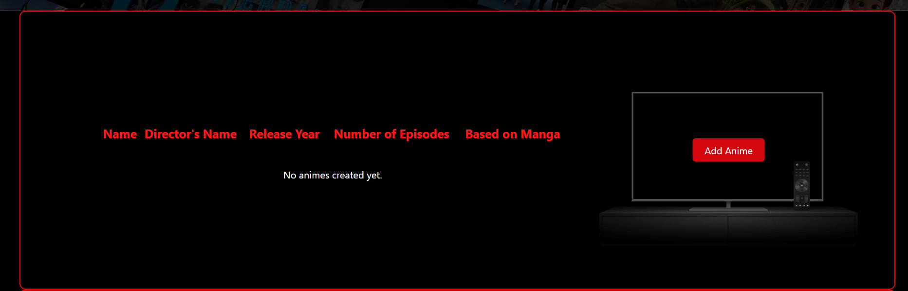

To run the project please do the following steps:

Create a Virtual Environment:

1. To create a virtual environment, navigate to the project directory and run the following command:

python -m venv env

This will create a new virtual environment in a directory called env.

2. Activate the Virtual Environment:
To activate the virtual environment, run the following command:

On Windows:

.\env\Scripts\activate

On Linux or macOS:

source env/bin/activate

3. Install Project Dependencies:

To install project dependencies, run the following command:

pip install -r requirements.txt

This will install all the required packages listed in the requirements.txt file.

4. Database Setup:
To set up the database, configure the database settings in settings.py by modifying the DATABASES dictionary.

5. After configuring the database settings, run migrations using the following command:
python manage.py migrate

6. Running the Django Project
Run the Development Server:
To run the Django development server, navigate to the project directory and run the following command:

python manage.py runserver

This will start the development server on http://127.0.0.1:8000/.

Main functionality: 

1. Sign in. You have to create a profile to use the platform. You don't have to put your real email, as the system doesn't check it. 

2. If you don't have a profile, you can click on REGISTER and fill the form. 

3. Once logged in, your name will be visible on the top of the website. 

4. You can create new animes clicking on the Add Anime button. 

5. This is how the form looks like. 

6. There is a complete CRUD functionality for these objects. As far as you add more than 3 elements pagination will start working. 

7. Also, there is search functionality based on the name, director's name and year of anume. 

8. Moreover, all the changes are saved in a CSV file to track them down if needed. 